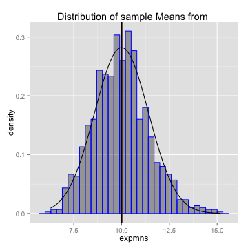

## Exploring the Exponential and Poisson Distributions through an Interactive Demo

Using the app, the Exponential and Poisson Distributions (both use the parameter lambda ($\lambda$)) will demonstrate how the Central Limit Theorem (CLT) relates to them. As the number of sample means goes up, the means and variances tend towards their theoretical values. However, with large numbers of counts/observations, we can see that while these provide good mean estimates, the variance is demonstrably larger.

Our goal is to illustrate these differences between mean and variance derived from simulation, observation and their expected(theoretical) values in an easy-to-use interative demo.

The demo provides the usage of the following user inputs through these controls:
+ choice of distribution - dropdown
+ $\lambda$ - numeric input
+ number of observations, number of simulations - sliders

---

## User inputs and Calculation

The simulation reacts to user inputs and loops using `rexp()` and `rpois()`, then tabulated and plotted against the expected values. The theoretical population mean and variance used are:
+ For poisson, both are set as $\lambda$
+ For exponential, $\mu$ = $\frac{1}{\lambda}$ and standard deviation $\sigma$ = $\frac{1/\lambda}{\sqrt(n)}$

```r
# Partial example with sample inputs for simulated values of an exponential distribution
set.seed(500); lambda <- 0.1; n <- 50; nsim <- 1000; expmns <- NULL
for (i in 1:nsim) expmns = c(expmns, mean(rexp(n, lambda))) # Simulation loop
mS <- mean(expmns) ; vS <- sd(expmns)^2         # Sample mean mS, variance vS
mE <- 1/lambda ; vE <- ((1/lambda)/sqrt(n))^2   # Expected mean mT and variance vT
stats <- rbind(mean=c(mS, mE), variance=c(vS, vE))
colnames(stats) <- c("Simulated", "Expected") ; stats
```

```
##          Simulated Expected
## mean      9.990137       10
## variance  2.096757        2
```

---

## Plots generated with ggplot2


```r
g <- ggplot(data.frame(expmns), aes(x=expmns)) + 
    geom_histogram(alpha = .40, binwidth = .3, colour = "blue", aes(y = ..density..)) + 
    geom_vline(xintercept = mS, size=1, color="red") + 
    geom_vline(xintercept = mE, size=1, color="black") + 
    labs(title="Distribution of sample Means from ", nsim, " Simulations of ", n," observations with lambda=", lambda)
g + stat_function(fun = dnorm, args=list(mean=mE, sd=sqrt(vE)))
```



---

## Reproducibility and Code links

The app can be run online: [Shiny app hosted by RStudio](https://slothdev.shinyapps.io/ddpproj/)

In order to run the app locally in RStudio (please check package and installation requirements in RStudio's [Getting Started page](http://shiny.rstudio.com/articles/shinyapps.html), then simply use the console command from RStudio:

```r
runGitHub('slothdev/ddpproj')
```

Links to the app and code repository:
+ All files and code used are available from my [Github Project Repository](https://github.com/slothdev/ddpproj) (https://github.com/slothdev/ddpproj)

